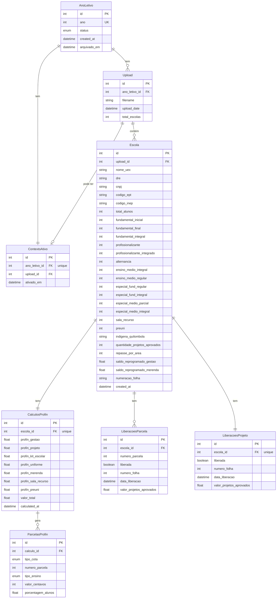

# Diagrama do Banco de Dados - Sistema PROFIN

## Diagrama ER (Entity-Relationship)

## Relacionamentos

| Relacionamento | Tipo | Cardinalidade | Cascade |
|---------------|------|---------------|---------|
| AnoLetivo → Upload | 1:N | Um ano tem vários uploads | DELETE CASCADE |
| AnoLetivo → ContextoAtivo | 1:1 | Um ano tem um contexto ativo | DELETE CASCADE |
| Upload → Escola | 1:N | Um upload tem várias escolas | DELETE CASCADE |
| Upload → ContextoAtivo | 1:0..1 | Um upload pode ter um contexto ativo | DELETE CASCADE |
| Escola → CalculosProfin | 1:1 | Uma escola tem um cálculo | DELETE CASCADE |
| CalculosProfin → ParcelasProfin | 1:N | Um cálculo tem várias parcelas | DELETE CASCADE |
| Escola → LiberacoesParcela | 1:N | Uma escola tem várias liberações de parcelas | DELETE CASCADE |
| Escola → LiberacoesProjeto | 1:1 | Uma escola tem uma liberação de projeto | DELETE CASCADE |

## Constraints

- **AnoLetivo.ano**: UNIQUE
- **ContextoAtivo.ano_letivo_id**: UNIQUE (apenas um contexto ativo por ano letivo)
- **Escola (upload_id, nome_uex, dre)**: UNIQUE
- **CalculosProfin.escola_id**: UNIQUE
- **ParcelasProfin (calculo_id, tipo_cota, numero_parcela, tipo_ensino)**: UNIQUE
- **LiberacoesParcela (escola_id, numero_parcela)**: UNIQUE
- **LiberacoesProjeto.escola_id**: UNIQUE

## Notas Importantes

- **estado_liberacao**: Campo removido da tabela `Escola`. O estado de liberação agora é derivado das tabelas `LiberacoesParcela` e `LiberacoesProjeto` através da função `escola_esta_liberada()`.
- **is_active**: Campo removido da tabela `Upload`. O upload ativo é gerenciado através da tabela `ContextoAtivo`, que mantém apenas um contexto ativo por ano letivo.
- **ContextoAtivo**: Gerencia qual upload está ativo para cada ano letivo, permitindo histórico completo de uploads sem sobrescrita.
